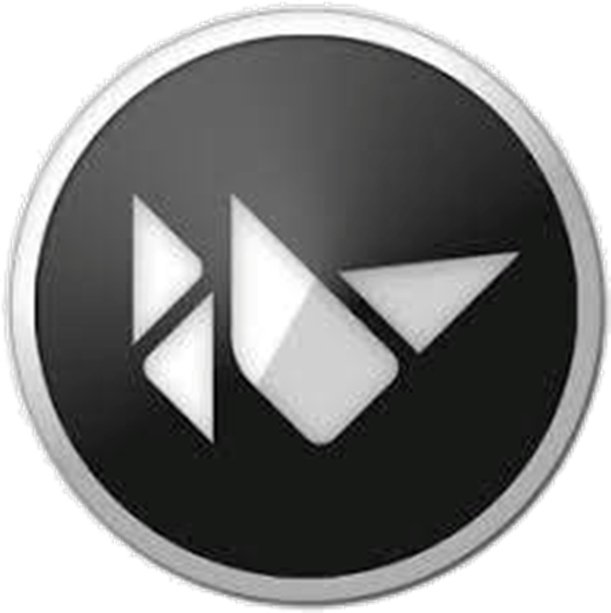

# Kivy

***Kivy*** is a free and open source Python framework for developing mobile apps and other multitouch application software with a natural user interface (NUI). It is distributed under the terms of the MIT License, and can run on Android, iOS, GNU/Linux, macOS, and Windows.

---

Kivy is the main framework developed by the Kivy organization, alongside Python for Android,[4] Kivy iOS,[5] and several other libraries meant to be used on all platforms. Kivy also supports the Raspberry Pi.

The framework contains all the elements for building an application such as:
* extensive input support for mouse, keyboard, TUIO, and OS-specific multitouch events
* a graphic library using only OpenGL ES 2, and based on Vertex Buffer Object and shaders
* a wide range of widgets that support multitouch
* an intermediate language (Kv)[8] used to easily design custom widgets.

Kivy is the evolution of the PyMT project, and is recommended for new projects.

---
